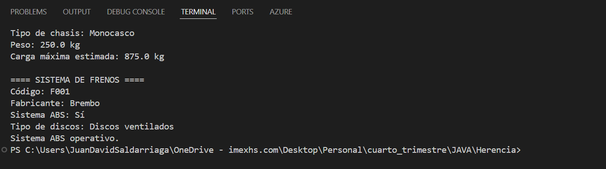

Proyecto Herencia

EXPLICACION HERENCIA 

La herencia es un principio de la Programacion Horientada a Objetos 
que se hace para que las subclase o clases hijas hereden de la clase padre y hacer uso de 
los atributos que posee la misma

